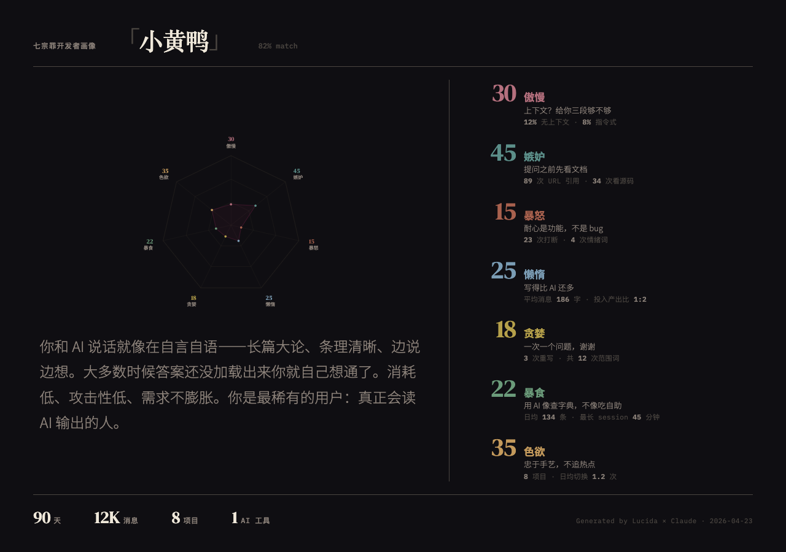

# Lucida

[English](../../README.md)

> 名字源自 *Camera Lucida* — 19 世纪用于肖像绘制的光学仪器。

**从你的 AI 对话数据生成性格画像。** 一个玩具项目，读取你和 AI 编程助手的聊天记录，生成可分享的视觉画像卡片。

<div align="center">
  
</div>

## 画像体系

### 七宗罪 ✅

从你与 AI 的交互行为中提取 7 个维度 — 懒惰、傲慢、色欲、暴食、贪婪、嫉妒、暴怒 — 打分后匹配 32 种人格类型，渲染成可分享的 HTML 卡片。

### 江湖门派 🚧

*规划中。* 武侠主题画像 — 少林、华山、逍遥……

## 快速开始

需要 [Claude Code](https://claude.ai/claude-code)。

```bash
# 克隆并进入项目
git clone https://github.com/vimo-ai/lucida.git
cd lucida

# 在 Claude Code 中运行
claude
# 然后输入: /seven-sins
```

Skill 位于 `.claude/skills/seven-sins/SKILL.md`，在项目目录中启动 Claude Code 即可自动识别。

## 数据源

| 优先级 | 路径 | 说明 |
|--------|------|------|
| 1 | `~/.claude/projects/` | Claude Code 原始 JSONL（人人都有） |
| 2 | `~/.vimo/db/ai-cli-session.db` | [Memex](https://github.com/vimo-ai/memex) session 数据库（更丰富） |

### 为什么推荐 Memex？

Claude Code 本地数据默认 30 天过期（可通过 `cleanupPeriodDays` 调整）。即使延长保留期，原始 JSONL 也只是散落在磁盘上的裸文件，没有索引、无法检索。[Memex](https://github.com/vimo-ai/memex) 提供：

- **结构化存储** — SQLite 完整 schema，session 和 message 分层管理
- **全文 + 语义检索** — FTS5 全文索引 + 向量搜索，随时找到任何对话
- **多 CLI 统一** — Claude Code、Codex、OpenCode、Gemini 一个数据库搞定

数据越多，画像越准。一个月的聊天记录只能画个草稿，一年的数据才是完整肖像。

## 工作原理

分析流水线由通用基础 + 可替换的"镜头"组成：

```
shared/data-extraction.md    → 通用：数据源检测 + 行为指标提取
.claude/skills/seven-sins/   → 镜头：七宗罪打分 + 32 类型匹配 + HTML 卡片
.claude/skills/jianghu/      → 镜头：（规划中）
```

1. **扫描** — 检测并读取可用数据源
2. **提取** — 计算行为指标（消息模式、活跃节奏、沟通风格等）
3. **打分** — 将指标映射到画像体系的各维度
4. **匹配** — 通过加权欧氏距离找到最接近的人格类型
5. **渲染** — 将数据填入 HTML 模板，生成可分享的画像卡片

## 项目结构

```
lucida/
├── .claude/skills/seven-sins/
│   ├── SKILL.md              # 七宗罪画像 skill
│   └── personality-types.md  # 32 种人格类型定义
├── shared/
│   └── data-extraction.md    # 通用数据提取流水线
├── templates/
│   └── seven-sins.html       # 报告模板（数据驱动）
├── output/                   # 生成的报告（gitignored）
└── README.md
```

## License

MIT

---

[vimo-ai](https://github.com/vimo-ai)
