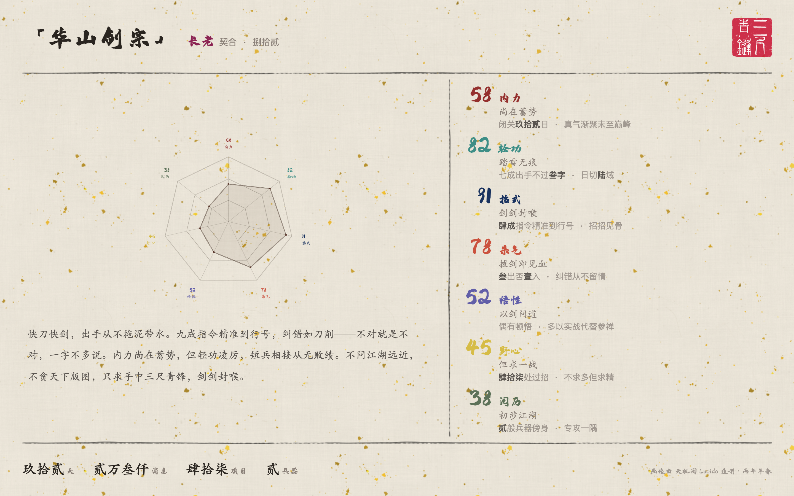

# Lucida

[English](../../README.md)

> 名字源自 *Camera Lucida* — 19 世纪用于肖像绘制的光学仪器。

**从你的 AI 对话数据生成性格画像。** 读取你和 AI 编程助手的聊天记录，生成可分享的视觉画像卡片。

## 画像体系

### 江湖门派

<div align="center">
  
</div>

武侠主题画像，从 7 个武学维度评分 — 内力、轻功、招式、杀气、悟性、野心、江湖阅历。匹配 27 个门派（少林、华山剑宗、逍遥派、唐门等），授予弟子、长老或掌门品阶。若无门派契合，则生成江湖散人身份，涵盖侠、商、隐、匠、官、暗六大类。

### 七宗罪

<div align="center">
  
</div>

从你与 AI 的交互行为中提取 7 个维度 — 懒惰、傲慢、色欲、暴食、贪婪、嫉妒、暴怒 — 打分后匹配 32 种人格类型，渲染成可分享的 HTML 卡片。

## 快速开始

需要 [Claude Code](https://claude.ai/claude-code)。

```bash
git clone https://github.com/vimo-ai/lucida.git
cd lucida

claude
# 然后输入: /jianghu 或 /seven-sins
```

Skill 位于 `.claude/skills/` 目录下，在项目目录中启动 Claude Code 即可自动识别。

## 数据源

| 优先级 | 路径 | 说明 |
|--------|------|------|
| 1 | `~/.vimo/db/ai-cli-session.db` | [Memex](https://github.com/vimo-ai/memex) session 数据库 |
| 2 | `~/.claude/projects/` | Claude Code 原始 JSONL |
| 3 | `~/.codex/` | [Codex](https://github.com/openai/codex) CLI 历史记录 |

**[Memex](https://github.com/vimo-ai/memex)** — AI 编程助手的会话记忆管理。Claude Code、Codex、OpenCode、Gemini 统一存储，不压缩、不丢失，支持全文 + 语义搜索，通过 MCP 直接调用。

## 工作原理

分析流水线由通用基础 + 可替换的「镜头」组成：

```
shared/data-extraction.md    → 通用：数据源检测 + 行为指标提取
.claude/skills/seven-sins/   → 镜头：七宗罪打分 + 32 类型匹配 + HTML 卡片
.claude/skills/jianghu/      → 镜头：武学维度打分 + 27 门派匹配 + HTML 卡片
```

1. **扫描** — 检测并读取可用数据源
2. **提取** — 计算行为指标（消息模式、活跃节奏、沟通风格等）
3. **打分** — 将指标映射到画像体系的各维度
4. **匹配** — 通过加权欧氏距离找到最接近的人格类型
5. **渲染** — 将数据填入 HTML 模板，生成可分享的画像卡片

## 构建依赖

江湖卡片的水墨渲染基于：

- [shuimo-core](https://github.com/JobinJia/shuimo-core) — 程序化水墨画生成引擎（宣纸纹理、印章、毛笔笔触）
- [shuimo-ui](https://github.com/shuimo-design/shuimo-ui) — 水墨风 Vue 组件库（[shuimo.design](https://shuimo.design)）

## 项目结构

```
lucida/
├── .claude/skills/
│   ├── seven-sins/
│   │   ├── SKILL.md              # 七宗罪画像 skill
│   │   └── personality-types.md  # 32 种人格类型定义
│   └── jianghu/
│       ├── SKILL.md              # 江湖画像 skill
│       └── sects.md              # 27 门派锚点定义
├── shared/
│   └── data-extraction.md        # 通用数据提取流水线
├── scripts/
│   └── extract-metrics.py        # 行为指标提取脚本
├── templates/
│   ├── seven-sins.html           # 七宗罪报告模板
│   └── jianghu-dev/              # 江湖卡片（Vue3 + Vite + shuimo）
├── output/                       # 生成的报告（gitignored）
└── README.md
```

## License

MIT

---

[vimo-ai](https://github.com/vimo-ai)
