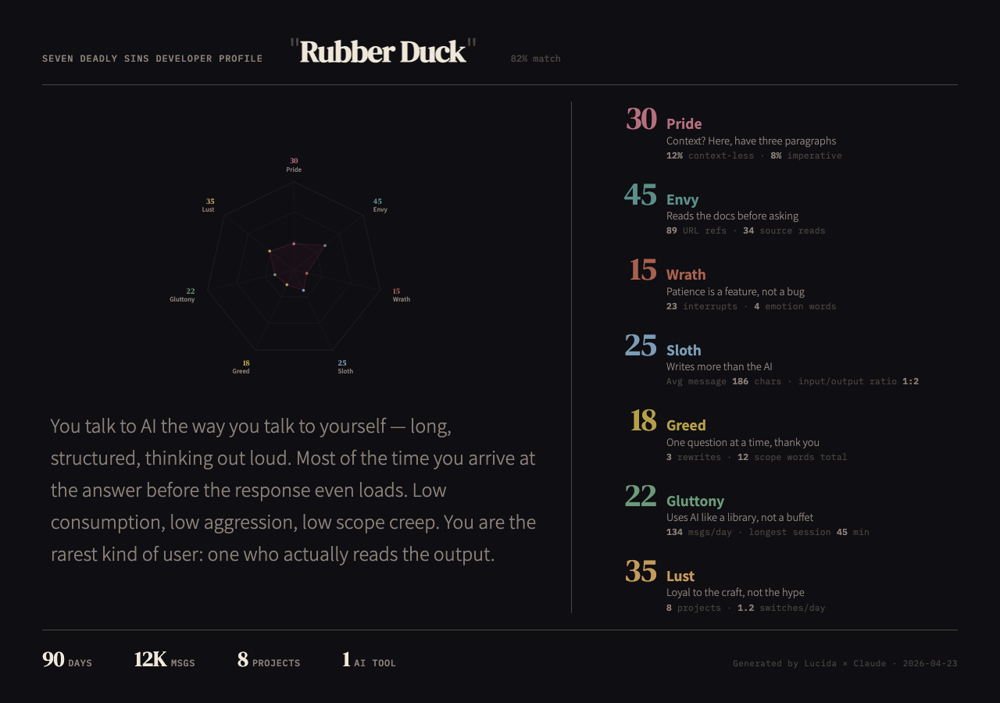

# Lucida

[中文](.github/docs/README-zh.md)

> Named after *Camera Lucida* — a 19th-century optical instrument for portrait drawing.

**Personality profiling from your AI conversation data.** Reads your chat history with AI coding assistants and generates shareable visual profile cards.

## Profiling Systems

### Jianghu Sects

<div align="center">
  
</div>

Wuxia-themed profiling across 7 martial dimensions — Inner Power, Lightness, Technique, Killing Intent, Comprehension, Ambition, World Experience. Matches you to one of 27 sects (Shaolin, Huashan Sword, Xiaoyao, Tang Clan, etc.) with a rank — Disciple, Elder, or Sect Leader. If no sect fits, generates a custom freelancer identity from 6 archetypes.

### Seven Deadly Sins

<div align="center">
  
</div>

Scores you across 7 dimensions — Sloth, Pride, Lust, Gluttony, Greed, Envy, Wrath — based on how you interact with AI. Matches you to one of 32 personality archetypes and renders a shareable HTML card.

## Quick Start

Requires [Claude Code](https://claude.ai/claude-code).

```bash
git clone https://github.com/vimo-ai/lucida.git
cd lucida

claude
# then type: /jianghu or /seven-sins
```

Skills live under `.claude/skills/` — Claude Code auto-detects them when you run it inside the project directory.

## Data Sources

| Priority | Path | Description |
|----------|------|-------------|
| 1 | `~/.vimo/db/ai-cli-session.db` | [Memex](https://github.com/vimo-ai/memex) session database |
| 2 | `~/.claude/projects/` | Claude Code native JSONL |
| 3 | `~/.codex/` | [Codex](https://github.com/openai/codex) CLI history |

**[Memex](https://github.com/vimo-ai/memex)** — Session history for AI coding assistants. One database for Claude Code, Codex, OpenCode, Gemini — never compacted, never lost. Full-text + semantic search via MCP.

## How It Works

The profiling pipeline has a shared foundation and swappable "lenses":

```
shared/data-extraction.md    → common: data source detection + behavioral metric extraction
.claude/skills/seven-sins/   → lens: sin scoring + 32 archetype matching + HTML card
.claude/skills/jianghu/      → lens: martial dimension scoring + 27 sect matching + HTML card
```

1. **Scan** — detect and read available data sources
2. **Extract** — compute behavioral metrics (message patterns, activity rhythms, communication style, etc.)
3. **Score** — map metrics to the chosen profiling system's dimensions
4. **Match** — find the closest archetype via weighted Euclidean distance
5. **Render** — fill a data-driven HTML template into a shareable card

## Built With

The Jianghu card's ink-wash rendering is powered by:

- [shuimo-core](https://github.com/JobinJia/shuimo-core) — procedural Chinese ink-wash painting engine (xuan paper texture, seal stamps, brush strokes)
- [shuimo-ui](https://github.com/shuimo-design/shuimo-ui) — ink-wash style Vue component library ([shuimo.design](https://shuimo.design))

## Project Structure

```
lucida/
├── .claude/skills/
│   ├── seven-sins/
│   │   ├── SKILL.md              # Seven Sins profiling skill
│   │   └── personality-types.md  # 32 archetype definitions
│   └── jianghu/
│       ├── SKILL.md              # Jianghu profiling skill
│       └── sects.md              # 27 sect anchor definitions
├── shared/
│   └── data-extraction.md        # Common data pipeline
├── scripts/
│   └── extract-metrics.py        # Behavioral metric extraction
├── templates/
│   ├── seven-sins.html           # Seven Sins report template
│   └── jianghu-dev/              # Jianghu card (Vue3 + Vite + shuimo)
├── output/                       # Generated reports (gitignored)
└── README.md
```

## License

MIT

---

[vimo-ai](https://github.com/vimo-ai)
